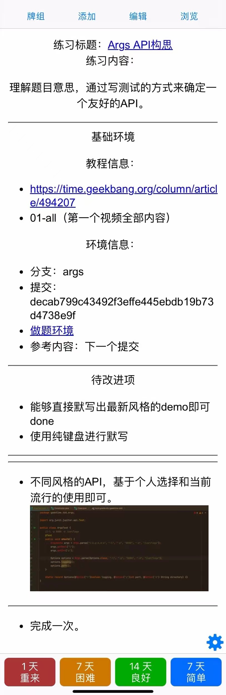

# geektime-tdd-practice

### What
- 这是[徐昊 · TDD 项目实战 70 讲](https://time.geekbang.org/column/intro/100109401?tab=intro)专栏的练习集。
- 包含待练习的任务、练习后的代码、练习中涉及的知识点，并且这些内容都包含在Anki中。
### Why
- 掌握 TDD 技能是一个困难而有意义的目标。而掌握该专栏的内容是达到该目标的坚实一步。
- 该项目的目标在于通过练习的方式来帮助做到真正内化该专栏的知识，而不是如春梦了无痕，只是学过而没有对现实有任何改变。
- 任何技能要真正掌握都需要大量的练习，练习除了量以外，要更快地完成练习目标，还需要保证练习的效果。
- 高效的练习符合以下规律，丰富模式、穿插练习、间隔重复、主动回想。而通过卡片进行练习以及结合Anki的功能既可以满足以上规律，实现高效练习。
- 此项目基于以上想法而开始。
### How
- 将该专栏的练习和知识点拆解为一个个练习，一个个练习由一张张卡片所承载。通过刷卡，完成练习来掌握课程中所传递的内容。
- 本项目提供的资料包括 Anki卡片包以及专栏中的代码实例（不同分支对应不同项目代码）。
- 学习方式推荐
    - 以项目为单位进行学习。
    - 首次学习按照课程顺序来进行练习。
    - 后续巩固学习按照课程随机顺序进行练习。
- 具体来说
    - 打开一张卡片，按照卡片要求自主完成该练习。
    - 然后刷下一个练习，以此类推直到每个练习至少完成 5 次（次数按具体情况可自行调整）。
- 所需环境
  - JDK 17+
  - [Anki](https://apps.ankiweb.net/)

#### Anki卡片
提供的Anki卡片牌组：
- [徐昊 · TDD 项目实战 70 讲 牌组](src/main/resources/flash_cards/徐昊_TDD项目实战70讲.apkg)

